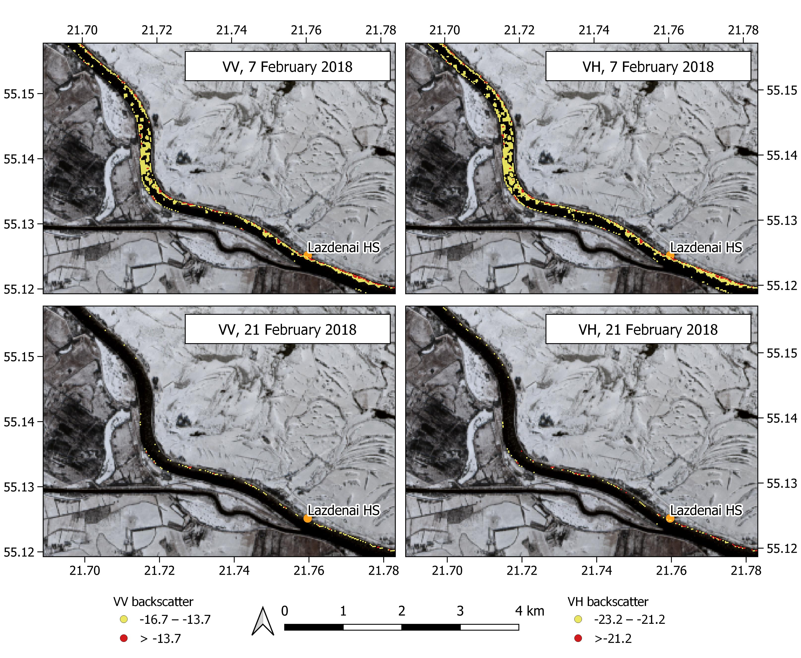

Ice Detection with Sentinel-1 SAR Backscatter Threshold
================
Edvinas Stonevicius
2022-04-10

``` r
library(data.table)
library(ggplot2)
library(ROCR)
library(cowplot)
library(scales)
```

# Introduction

Climate change leads to more variable meteorological conditions. In many
Northern Hemisphere temperate regions, cold seasons have become more
variable and unpredictable, necessitating frequent river ice
observations over long sections of rivers. Satellite SAR (Synthetic
Aperture Radar)- based river ice detection models have been successfully
applied and tested, but different hydrological, morphological and
climatological conditions can affect their skill. In this study, we
developed and tested Sentinel-1 SAR-based ice detection models in 525 km
sections of the Nemunas and Neris Rivers (Figure 1). We analyzed three
binary classification models based on VV, VH backscatter and logistic
regression.


# Data

We used matchups (within a 24 h window) between the Sentinel-1 SAR IW
GRD High-Resolution and Sentinel-2 MSI Level1C acquisitions during the
2015–2019 cold seasons to train and test ice detection models.

    ## Classes 'data.table' and 'data.frame':   1031878 obs. of  8 variables:
    ##  $ long        : num  24 24 24 24 24 ...
    ##  $ lat         : num  54.6 54.6 54.6 54.6 54.6 ...
    ##  $ set         : chr  "Only ice" "Only ice" "Only ice" "Only ice" ...
    ##  $ date        : Date, format: "2018-03-06" "2018-03-06" ...
    ##  $ s2code      : num  1 1 1 1 1 1 1 1 1 1 ...
    ##  $ s2          : chr  "ice" "ice" "ice" "ice" ...
    ##  $ Polarization: Factor w/ 2 levels "vv","vh": 1 1 1 1 1 1 1 1 1 1 ...
    ##  $ Sigma0      : num  -10 -11.1 -11.9 -11 -11.1 ...
    ##  - attr(*, ".internal.selfref")=<externalptr>

# Backscatter from Ice and Open Water

To determine the optimal threshold between backscatter from water and
ice, we analyzed the distribution of SAR backscatter values from river
ice and open water (Figure 2).

``` r
#Create new data set names for visualization
d[set=="Only ice", Data:="Ice"]
d[set=="Only water",Data:="Water (excluding pixels within 30 m zone from banks)"]
d[set=="All water pixels", Data:="Water (all river pixels)"]
d[Polarization=="vv", Polarization:="VV"]
d[Polarization=="vh", Polarization:="VH"]

#Force ggplot2 to use minus sign in figures
unicode_minus = function(x) sub('^-', '\U2212', format(x))

ggplot(data=d, aes(Sigma0, fill=Data))+
  geom_density(alpha=0.5)+
  facet_wrap(~Polarization)+
  scale_x_continuous(labels = unicode_minus) +
  coord_cartesian(xlim = c(-35,0))+
  scale_fill_manual(values = c("#a50f15","grey10" ,"#045a8d" ))+
  theme_minimal()+
  theme(legend.position = "bottom", text=element_text(size=12, color = "black"))+
  guides(fill = guide_legend(nrow = 3))+
  labs(fill=NULL, y="Density")
```


Higher backscatter values were from the pixels in areas near riverbanks
and were likely caused by mixed land-water pixels due to the backscatter
from aquatic and riparian vegetation or exposed river bottoms. Using a
trial-and-error method, we decided to use only pixels located farther
than 30 m away from riverbanks, thus removing pixels that could cause
uncertainty.

# Logistic Classification Model

We used linear logistic model :

) = \beta_0 + \beta_{VV} * VV_{Sigma0} + \beta_{VH} * VH_{Sigma0} ,
")

where p is the probability of ice;

and

are the scattering coefficient values in the VV and VH polarizations;
and
,

and

are the model parameters.  
Sen2Cor class was a used as a target label for model training and
testing. Considering the possible uncertainties in data, variable
conditions in different parts of river and relatively small dataset
(238,202 observations), we used 100 subsets of 7500 pixels, selected
with replacements from training dataset, to study the variability of the
logistic model parameters (Figure 3).

``` r
#Permutation of dataset---------------------------------
perm<-list()

n<-100
set.seed(101)
for(i in 1:n)
{
  perm[[paste0("n",i)]]<-sample(1:nrow(d), size=7500, replace = TRUE)
}

perm_d<-lapply(perm, function(x){d[x]})


#Function for fitting of model and extraction of coefficients model------------------------
logit_model_coeff<-function(x){
  model<-glm(formula= s2code~vh+vv, data=x, family = binomial(link = "logit"))
logit_coef<-coef(model)
}
#Model coefficients for subsets------------------------
perm_coef<-as.data.table(round(sapply(perm_d, logit_model_coeff),3),keep.rownames = "Coefficient")
perm_coef[Coefficient=="(Intercept)", Coefficient:="Intercept"]
perm_coef_long<-melt(perm_coef, id.vars = "Coefficient", variable.name="Dataset", value.name="value")
```

``` r
#Function to create equal y scale brakes
equal_breaks <- function(n = 3, s = 0.05, ...){
  function(x){
    d <- s * diff(range(x)) / (1+2*s)
    precizion<-ifelse(abs(mean(x))<1,2,1)
    round(seq(min(x)+d, max(x)-d, length=n),precizion)}}

#Create correct greek names for coefficients
perm_coef_long[Coefficient=="vv", coef_names:="beta[VV]"]
perm_coef_long[Coefficient=="vh", coef_names:="beta[VH]"]
perm_coef_long[Coefficient=="Intercept", coef_names:="beta[0]"]


ggplot(perm_coef_long, aes(x=1, y=value))+
  geom_violin(trim = FALSE)+
  geom_jitter(position=position_jitter(0.3))+
  facet_wrap(~coef_names,  scales = "free_y",labeller=label_parsed)+
  scale_y_continuous(breaks=equal_breaks(n=5, s=0.1), expand = c(0.1, 0), labels = unicode_minus)+
  coord_cartesian(xlim = c(0.0,2))+
  guides(x = "none")+
  labs(y="Logistic model coefficient value", x=NULL)+
  theme_minimal()+
  theme( panel.grid.major.x = element_blank(), panel.grid.minor = element_blank(),
         panel.border = element_rect(color = "grey", fill = NA, size = 1),
         panel.spacing = unit(2, "lines"))
```


Due to small variance of valies of model parameters in 100 subsets we
decided to use the model fitted to all training data for further
analysis:

``` r
#Fitting model to all training data
model_coeff<-round(logit_model_coeff(d),2)
```

) = 7.8 + 0.76 * VV_{Sigma0}  -0.07 * VH_{Sigma0}
")

# Classification Threshold

To use SAR backscatter values in binary classification, the threshold
dividing the ice and water classes must be estimated. In this study, we
determined the optimal threshold for the classification models based on
VV and VH polarization backscatter, as well as the logistic model, using
the sensitivity and specificity (true negative rate) of classification
with different threshold values. The sensitivity (true positive rate) in
our case corresponds to the ratio of correctly identified ice, and the
specificity (true negative rate) shows correctly detected water. The aim
is to develop a classification model for the correct identification of
both ice and water. Thus, the optimal threshold value for a
classification is where the specificity and sensitivity are equal
(Figure 4).

``` r
#Logit_response function -----------------------
logit_response<-function(x){
  
  model<-glm(formula= s2code~vh+vv, data=x, family = binomial(link = "logit"))
  x$logit<-predict(newdata=x, model,type='response')
  return(x)
}

perm_wlogit<-lapply(perm_d,logit_response)

#Sensitivity & specificity function -----------------------
sen_spe_sigma_logit<-function(x)
{
  pred_vh <- prediction( x$vh, x$s2code) 
  perf_vh<-performance(pred_vh, "tpr", "tnr")
  data_vh<-data.table(tpr=unlist(perf_vh@y.values),
                        tnr=unlist(perf_vh@x.values),
                        cutoff=round(unlist(perf_vh@alpha.values),2))
  
  #Reduction of observations No. to speed up analysis
  small_data_vh<-data_vh[is.finite(cutoff) ,.(tpr=round(mean(tpr),3),
                                                    tnr=round(mean(tnr),3),
                                                    type="vh"),cutoff]
  
  pred_vv<- prediction( x$vv, x$s2code)
  perf_vv<-performance(pred_vv, "tpr", "tnr")
  data_vv<-data.table(tpr=unlist(perf_vv@y.values),
                         tnr=unlist(perf_vv@x.values),
                         cutoff=round(unlist(perf_vv@alpha.values),2))
  
 #Reduction of observations No. to speed up analysis
  small_data_vv<-data_vv[is.finite(cutoff) ,.(tpr=round(mean(tpr),3),
                                                    tnr=round(mean(tnr),3),
                                                    type="vv"),cutoff]
  
  pred_logit <- prediction( x$logit, x$s2code)
  perf_logit<-performance(pred_logit, "tpr", "tnr")
  data_logit<-data.table(tpr=unlist(perf_logit@y.values),
                         tnr=unlist(perf_logit@x.values),
                         cutoff=round(unlist(perf_logit@alpha.values),3))
  #Reduction of observations No. to speed up analysis
  small_data_logit<-data_logit[is.finite(cutoff) ,.(tpr=round(mean(tpr),3),
                                                    tnr=round(mean(tnr),3),
                                                    type="logit"),cutoff]
  #Combination of output for all models
  data<-rbind(small_data_vv,small_data_vh,small_data_logit)
  
}

#Calculation of specificity and sensitivity for all permuted subsets
cutoff_sen_spe<-rbindlist(lapply(perm_wlogit,sen_spe_sigma_logit), id="number")

#Determination of optimal cutoff 
#using balance of specificity and sensitivity with 0.005 margin.
optimal_cutoff<-data.table(cutoff_sen_spe[abs(tpr-tnr)<0.005,.(optimal=round(max(cutoff),3)),
                                          by=c("number", "type")])

# Optimal cutoff statistics for uncertainty analysis---------------------
optimal_statistics<-optimal_cutoff[,.(median=round(median(optimal),2),
                                   mean=round(mean(optimal),2),
                                   sd=round(sd(optimal),2)), by="type"]

# Rounding of VV and VH coefficients for better presentation in text
optimal_statistics[type %in% c("vv", "vh" ), c("mean","sd"):=.(round(mean,1), round(sd,1))]
```

``` r
optimal_cutoff[type=="vv", type1:="VV"]
optimal_cutoff[type=="vh", type1:="VH"]
optimal_cutoff[type=="logit", type1:="Logistic"]

optimal_cutoff_sen_spe<-merge(cutoff_sen_spe,optimal_cutoff,by=c("type", "number"))

optimal_cutoff_sen_spe[type=="vv", type1:="VV"]
optimal_cutoff_sen_spe[type=="vh", type1:="VH"]
optimal_cutoff_sen_spe[type=="logit", type1:="Logistic"]

ggplot(optimal_cutoff_sen_spe)+
  geom_line(aes(x=cutoff, y=tpr, group=number, color="Ice"), alpha=0.5)+
  geom_line(aes(x=cutoff, y=tnr, group=number, color="Water"), alpha=0.5)+
  geom_vline(aes(xintercept=optimal, colour="Optimal"), lwd=1, alpha=0.2,key_glyph = "blank")+
  scale_color_manual( name="", values=c(Ice="#a50f15", Water="#045a8d", Optimal="gray50"),
                      breaks = c("Ice", "Water", "Optimal"),
                      labels=c(Ice="Ice", Water="Water", Optimal="Optimal threshold"))+
  labs(x="Threshold (for VV and VH in dB)", y="True prediction rate")+
  facet_wrap(~type1, scales = "free_x")+
  coord_cartesian(ylim = c(-0.01,1.01),expand = FALSE)+
  scale_x_continuous(labels = unicode_minus) +
  theme_minimal()+
  theme(legend.position = "bottom", 
        panel.border = element_rect(color = "grey", fill = NA, size = 1),
        panel.spacing = unit(2, "lines"),
        text=element_text(size=12, color = "black"))
```


The variability of the optimal threshold for river surface type
classification was based on the VV polarization scattering coefficient
(mean = -13.7 dB, standard deviation = 0.2 dB) and VH polarization
scattering coefficient (mean = -21.2 dB, standard deviation = 0.1 dB)
was small (Figure 4). The variation of the optimal threshold was
relatively large in the case of the logistic model (mean = 0.24 dB,
standard deviation = 0.02 dB).

The model parameters

and

were highly correlated in models fitted to 100 training data subsets
(Figure 5). These parameters were linearly combined in the logistic
model, and the increase of the

parameter compensated the decrease of the

parameter. There was also a strong positive correlation between the
,
and

parameters (Figure 5). The optimal threshold value of the analyzed
models had no clear link to the combinations of logistic model
parameters. High and low threshold values were scattered in the
parameter space without clear patterns (Figure 5), showing that the
reduction of degrees of freedom is not likely to significantly affect
the variability of optimal threshold values.

``` r
perm_coef_wide<-dcast(perm_coef_long, Dataset~Coefficient)
optimal_cutoff_logit<-optimal_cutoff[type=="logit",]

coef_cutoff<-merge(perm_coef_wide,optimal_cutoff_logit, by.x="Dataset", by.y="number")

p_size<-2
fill_palette<-"RdYlGn"

p1<-ggplot(coef_cutoff, aes(x=vv, y=Intercept, fill=optimal))+
  geom_point(size=p_size, alpha=0.8, shape=21)+
  scale_fill_distiller(palette = fill_palette)+
  scale_x_continuous(limits = c(0.58,0.93), breaks = c(0.6,0.7,0.8,0.9))+
  scale_y_continuous(limits = c(6.8,9.1), breaks = c(7.0, 7.5, 8.0,8.5,9.0))+
  labs(x = expression(paste(beta[VV])), y = expression(paste(beta[0])))+
  theme_minimal()+
  theme( panel.grid.major = element_blank(), panel.grid.minor = element_blank(),
         panel.border = element_rect(color = "grey", fill = NA, size = 1))

p2<-ggplot(coef_cutoff, aes(x=vh, y=Intercept, fill=optimal))+
  geom_point(size=p_size, alpha=0.8, shape=21)+
  scale_fill_distiller(palette = fill_palette)+
  scale_x_continuous(limits = c(-0.2,0.1), breaks = c(-0.2,-0.1,-0.0,0.1))+
  scale_y_continuous(limits = c(6.8,9.1), breaks = c(7.0, 7.5, 8.0,8.5,9.0))+
  labs(x = expression(paste(beta[VH])), y = expression(paste(beta[0])))+
  theme_minimal()+
  theme( panel.grid.major = element_blank(), panel.grid.minor = element_blank(),
         panel.border = element_rect(color = "grey", fill = NA, size = 1))


p3<-ggplot(coef_cutoff, aes(x=vh, y=vv, fill=optimal))+
  geom_point(size=p_size, alpha=0.8, shape=21)+
  scale_fill_distiller(palette = fill_palette)+
  scale_y_continuous(limits = c(0.58,0.93), breaks = c(0.6,0.7,0.8,0.9))+
  scale_x_continuous(limits = c(-0.2,0.1), breaks = c(-0.2,-0.1,-0.0,0.1))+
  labs(x = expression(paste(beta[VH])), y = expression(paste(beta[VV])))+
  theme_minimal()+
  theme( panel.grid.major = element_blank(), panel.grid.minor = element_blank(),
         panel.border = element_rect(color = "grey", fill = NA, size = 1))


prow <- plot_grid(p1+ theme(legend.position="none"),
                  p2+ theme(legend.position="none"),
                  p3+ theme(legend.position="none"),
                  labels = c(paste("r =", round(cor(coef_cutoff$vv,coef_cutoff$Intercept),2)),
                             paste("r =", round(cor(coef_cutoff$vh,coef_cutoff$Intercept),2)),
                             paste("r =", round(cor(coef_cutoff$vv,coef_cutoff$vh),2))),
                  label_size = 10,label_x=0.5, label_y=1,hjust = 0.1,vjust = 3,
                  align = 'vh', nrow = 1)

legend_b <- get_legend(p1 + guides(fill = guide_colourbar(title="Optimal cutoff", title.vjust=0.8, barwidth=16)) +
    theme(legend.position = "bottom"))

plot_grid(prow, legend_b, ncol = 1, rel_heights = c(1, .1))
```


The variability of estimated thresholds was small in comparison to
desired precision. Thus, we used the mean of estimated threshold values
for river ice detection:


# Model Validation

The goal of binary classification is to assign discrete classes to
continuous data. This discrimination between ice and open water classes
works best when observations are in separate clusters divided by the
selected threshold. In training data, we had two clusters: one for
pixels with ice and one for pixels with water (Figure 6). We had a
variety of conditions in our testing dataset. Most of the pixels from 18
January 2017 and 21 February 2018 were in two distinct clusters, and
only a few pixels were near the classification threshold point.
Similarly, most of the pixels from 25 January 2017 were in two distinct
clusters, but one of the clusters, which is likely to be composed of
pixels with ice cover, was located near the crossing of classification
thresholds of VH and VV polarizations (Figure 6). On other dates, the
pixels did not form distinct ice and open water clusters.

``` r
#Preparation of labels for figure
s1s2[, date:=as.character(date)]

s1s2[set %in% c( "Only ice", "Only water" ), date:="Training data"]

s1s2[date=="2017-01-18", long_date:="18 January 2017"]
s1s2[date=="2017-01-25", long_date:="25 January 2017"]
s1s2[date=="2017-02-14", long_date:="14 February 2017"]
s1s2[date=="2018-02-07", long_date:="7 February 2018"]
s1s2[date=="2018-02-21", long_date:="21 February 2018"]
s1s2[date=="2018-02-24", long_date:="24 February 2018"]
s1s2[date=="2018-02-26", long_date:="26 February 2018"]
s1s2[date=="Training data", long_date:="Training data"]

s1s2[,long_date:=factor(long_date, levels = c("18 January 2017", "25 January 2017","14 February 2017","7 February 2018",
                                              "21 February 2018", "24 February 2018","26 February 2018","Training data"))]

ggplot(data=s1s2, aes(x=vv, y=vh))+
  geom_density_2d_filled(contour_var = "count", breaks=c(0,150,300,500,1000,2000,3500,7000,12000))+
  scale_x_continuous(labels = unicode_minus) + scale_y_continuous(labels = unicode_minus)+
  scale_fill_brewer(palette = "Blues")+
  geom_vline(xintercept = optimal_statistics[type=="vv", mean], color="red")+
  geom_hline(yintercept = optimal_statistics[type=="vh", mean], color="red")+
  labs(x = expression(VV[Sigma0]), y=expression(VH[Sigma0]), fill="Number of observations")+
  coord_cartesian(xlim = c(-30, 0), ylim = c(-32, -5))+
  annotate(geom="text", x=-6, y=-5, label="VV and VH ice", color="black", size = 2)+
  annotate(geom="text", x=-23, y=-31, label="VV and VH water", color="black",size = 2)+
  annotate(geom="text", x=-6, y=-31, label="VV ice, VH water", color="black", size = 2)+
  annotate(geom="text", x=-23, y=-5, label="VV water, VH ice", color="black", size = 2)+
  facet_wrap(~long_date, ncol = 4)+
  theme_minimal()+
  theme(legend.position = "bottom", panel.grid.major.x = element_blank(), panel.grid.minor = element_blank(),
        panel.border = element_rect(color = "grey", fill = NA, size = 1))
```


``` r
#prediction------------------------------------------------
s1s2[,vv_code:=ifelse(vv>=optimal_statistics[type=="vv",mean],1,0)]
s1s2[,vh_code:=ifelse(vh>=optimal_statistics[type=="vh",mean],1,0)]
s1s2[,logit_code:=ifelse(logit>=optimal_statistics[type=="logit",mean],1,0)]

metrics_list<-list()

s1s2[, date:=as.character(date)]

s1s2[set %in% c( "Only ice", "Only water" ), date:="Training"]

d_list<-split(s1s2, by="date") 

# Accuracy
acc<-function(x)
{
  pred_vh <- prediction( x$vh_code, x$s2code)
  perf_vh<-performance(pred_vh, "acc")
  acc_vh=round(unlist(perf_vh@y.values)[2],2)
  
  pred_vv<- prediction( x$vv_code, x$s2code)
  perf_vv<-performance(pred_vv, "acc")
  acc_vv=round(unlist(perf_vv@y.values)[2],2)
  
  pred_logit<- prediction( x$logit_code, x$s2code)
  perf_logit<-performance(pred_logit, "acc")
  acc_logit=round(unlist(perf_logit@y.values)[2],2)
  
  data<-data.table(vh=acc_vh,vv=acc_vv, logit=acc_logit)
  
}
metrics_list$acc<-rbindlist(lapply(d_list,acc), idcol = "date")

# True positive rate. P(Yhat = + | Y = +). Estimated as: TP/P.---------------------------------

tpr<-function(x)
{
  pred_vh <- prediction( x$vh_code, x$s2code)
  perf_vh<-performance(pred_vh, "tpr")
  tpr_vh=round(unlist(perf_vh@y.values)[2],2)
  
  pred_vv<- prediction( x$vv_code, x$s2code)
  perf_vv<-performance(pred_vv, "tpr")
  tpr_vv=round(unlist(perf_vv@y.values)[2],2)
  
  pred_logit<- prediction( x$logit_code, x$s2code)
  perf_logit<-performance(pred_logit, "tpr")
  tpr_logit=round(unlist(perf_logit@y.values)[2],2)
  
  data<-data.table(vh=tpr_vh,vv=tpr_vv, logit=tpr_logit)
  
}
metrics_list$tpr<-rbindlist(lapply(d_list,tpr), idcol = "date")

#True negative rate. P(Yhat = - | Y = -). TN/N ????----------------------------------
tnr<-function(x)
{
  pred_vh <- prediction( x$vh_code, x$s2code)
  perf_vh<-performance(pred_vh, "tnr")
  tnr_vh=round(unlist(perf_vh@y.values)[2],2)
  
  pred_vv<- prediction( x$vv_code, x$s2code)
  perf_vv<-performance(pred_vv, "tnr")
  tnr_vv=round(unlist(perf_vv@y.values)[2],2)
  
  pred_logit<- prediction( x$logit_code, x$s2code)
  perf_logit<-performance(pred_logit, "tnr")
  tnr_logit=round(unlist(perf_logit@y.values)[2],2)
  
  data<-data.table(vh=tnr_vh,vv=tnr_vv, logit=tnr_logit)
  
}
metrics_list$tnr<-rbindlist(lapply(d_list,tnr), idcol = "date")

# Combined metrics-----------------------------------
metrics<-rbindlist(metrics_list, idcol = "measure")
metrics_out<-metrics[order(measure, date)]


#Number of pixels in each class
pix_N<-s1s2[, list(pixels=.N), by = c( "date","s2")]
pix_N[s2=="ice", s2:="Sen2Cor Ice"]
pix_N[s2=="water", s2:="Sen2Cor Water"]
```

``` r
metrics_out[measure=="acc", measure:="Accuracy"]
metrics_out[measure=="tpr", measure:="Correctly identified ice"]
metrics_out[measure=="tnr", measure:="Correctly identified water"]
metrics_out[measure=="Correctly identified ice", s2:="Sen2Cor Ice"]
metrics_out[measure=="Correctly identified water", s2:="Sen2Cor Water"]

data<-merge(metrics_out[measure!="Accuracy"], pix_N, by=c("date", "s2"))
data_l<-melt(data,id.vars=c("date","s2","measure", "pixels"),
             variable.name = "method",variable.factor = FALSE, value.name = "value")
data_l[,ncorrect:= round(pixels*value,0)]
data_l[,nincorrect:=round(pixels*(1-value),0)]
data_figure<-melt(data_l,id.vars=c("date","s2","measure", "method", "pixels","value" ), 
                  variable.name = "prediction", variable.factor = FALSE, value.name = "npix")

data_figure[method=="vv", method:="VV"]
data_figure[method=="vh", method:="VH"]
data_figure[method=="logit", method:="Logistic"]
data_figure[prediction=="ncorrect", prediction:="Same class as Sen2Cor"]
data_figure[prediction=="nincorrect", prediction:="Different class from Sen2Cor"]


data_figure[date=="2017-01-18", long_date:="18 January 2017"]
data_figure[date=="2017-01-25", long_date:="25 January 2017"]
data_figure[date=="2017-02-14", long_date:="14 February 2017"]
data_figure[date=="2018-02-07", long_date:="7 February 2018"]
data_figure[date=="2018-02-21", long_date:="21 February 2018"]
data_figure[date=="2018-02-24", long_date:="24 February 2018"]
data_figure[date=="2018-02-26", long_date:="26 February 2018"]
data_figure[date=="Training", long_date:="Training"]

data_figure[,long_date:=factor(long_date, 
                               levels = c("18 January 2017", "25 January 2017",
                                          "14 February 2017","7 February 2018",
                                          "21 February 2018", "24 February 2018",
                                          "26 February 2018","Training data"))]
```

``` r
ggplot(data_figure[date!="Training"], aes(x=long_date,y=npix, fill=prediction))+
  geom_col(position = position_stack())+
  facet_grid(s2~method)+
  scale_fill_brewer(palette = "Dark2", direction = -1)+
  scale_y_continuous(labels = comma)+
  labs(x = NULL, y = "Number of observations", fill=NULL)+
  theme_minimal()+
  theme(legend.position = "bottom", axis.text.x = element_text(angle=90, vjust = 0.5, hjust = 1), 
        panel.grid.major.x = element_blank(), panel.grid.minor = element_blank(),
        panel.border = element_rect(color = "grey", fill = NA, size = 1))
```


In the following figures created with [QGIS](https://qgis.org/), we
present a more detailed analysis of the agreement between SAR-based
classification and Sen2Cor ice and water classes. We focus on the
possible causes of classification uncertainty and model performance
under different ice conditions.


According to ground observations on the 14 February 2017, the river
surface in the observer’s field of view was mostly covered with ice.
Therefore, we cosnider SAR classification for this date more accurate
than Sen2Cor, especialy in the case of VV model.


On 7 February 2018, border ice and sparse frazil ice were observed in
most hydrological stations. The Sen2Cor processor and SAR-based
classification models detected border ice, but were unable to detected
frazil ice in the river channel.To understand if different SAR
backscatter thresholds could be used to detect sparse frazil ice, we
used the 0.9 quantile of backscatter values from water pixels in the
training dataset (-16.7 dB for VV and -23.2 dB for VH).Using lowered
threshold value the sparse frazil ice was detected. The trade-off of
more sensitive ice detection would lead to the misclassification of
water pixels. In case of this experimentation, 10% of pixels in our
training dataset representing backscatter from open water in late spring
and early autumn would be misclassified as ice.

# Conclusions

The river ice detection based on optical data had large uncertainties
related to cloud cover and shadows. Thus, it cannot be reliably used as
a single ground truth source in the quantitative evaluation of SAR-based
ice detection model accuracy. Additional ground observation data and the
manual interpretation of optical images are necessary to understand the
prediction accuracy. Sentinel-1 SAR models were more reliable and more
accurate in Nemunas and Neris River ice detection than Sentinel-2 MSI
Sen2Cor scene classification. The ice detection model based on VV
polarization backscatter performed better than the model based on VH
backscatter. The correlation between the predictions of the VV model and
logistic model, linearly combining VV and VH polarization backscatter,
was r = 0.99. Thus, the use of logistic model does not offer significant
gains in practice.

The optimal thresholds of the classification model-estimated findings
when specificity was equal to sensitivity performed well in most parts
of the Neris and Nemunas Rivers, except the section in which river
hydrology was affected by the Kaunas HPS Reservoir. To achieve better
classification accuracy, separate ice detection models could be
developed for river sections with diverse hydrology and morphology. With
the determined thresholds, we were able to detect consolidated, border
and dense frazil ice. However, in the case of sparse frazil ice, the
detection threshold had to be lowered, increasing model sensitivity.

Our study results support that Sentinel-1 SAR backscatter can be used to
detect ice with high confidence, but, in most cases, the development and
validation of models requires the manual inspection of training data
quality and validation on river sections with different hydrological
conditions. The proposed methodology would provide most confident
results in lowland rivers with steady currents, but it might not be
applicable in sections with disturbed water surfaces near riffles or
rapids and in sections with a very slow current, for example,
valley-dammed reservoirs.
